<!--
  This README is generated. Edit generator/profile.py, then run: python -m generator.build
  Images are hand-built SVGs (generator/components) with embedded font subsets,
  rebuilt daily by .github/workflows/profile.yml.
-->

<a href="https://mhassamzahid.vercel.app"><picture><source media="(prefers-color-scheme: dark)" srcset="assets/hero-dark.svg"></picture></a>

<a href="mailto:mhassam.dev@gmail.com"><picture><source media="(prefers-color-scheme: dark)" srcset="assets/btn-email-dark.svg"></picture></a>&nbsp;<a href="https://mhassamzahid.vercel.app/Hassam_Zahid_AI_Engineer_CV.pdf"><picture><source media="(prefers-color-scheme: dark)" srcset="assets/btn-cv-dark.svg"></picture></a>&nbsp;<a href="https://mhassamzahid.vercel.app"><picture><source media="(prefers-color-scheme: dark)" srcset="assets/btn-site-dark.svg"></picture></a>

<picture><source media="(prefers-color-scheme: dark)" srcset="assets/trace-dark.svg"></picture>

| At a glance | |
|:--|:--|
| **Looking for** | AI Engineer roles building LLM-powered products |
| **Now** | Python Developer @ Axioware Solutions · Sep 2025 – present |
| **Core** | RAG · LLM agents · MCP · ElevenLabs voice agents · n8n · FastAPI · Next.js · AWS |
| **Education** | BS Software Engineering, Usman Institute of Technology · 2022 – 2026 |
| **Based** | Karachi, PK · UTC+5 |
| **Reach me** | [mhassam.dev@gmail.com](mailto:mhassam.dev@gmail.com) · [CV (PDF)](https://mhassamzahid.vercel.app/Hassam_Zahid_AI_Engineer_CV.pdf) · [mhassamzahid.vercel.app](https://mhassamzahid.vercel.app) |

<picture><source media="(prefers-color-scheme: dark)" srcset="assets/section-impact-dark.svg"></picture>

<picture><source media="(prefers-color-scheme: dark)" srcset="assets/metrics-dark.svg"></picture>

<picture><source media="(prefers-color-scheme: dark)" srcset="assets/section-work-dark.svg"></picture>

<a href="https://mhassamzahid.vercel.app/work/haxmind"><picture><source media="(prefers-color-scheme: dark)" srcset="assets/cards/haxmind-dark.svg"></picture></a>
<a href="https://mhassamzahid.vercel.app/work/ai-sales-call-analysis"><picture><source media="(prefers-color-scheme: dark)" srcset="assets/cards/ai-sales-call-analysis-dark.svg"></picture></a>

<a href="https://mhassamzahid.vercel.app/work/vyva-voice-companion"><picture><source media="(prefers-color-scheme: dark)" srcset="assets/cards/vyva-voice-companion-dark.svg"></picture></a>
<a href="https://mhassamzahid.vercel.app/work/call-ai-automation"><picture><source media="(prefers-color-scheme: dark)" srcset="assets/cards/call-ai-automation-dark.svg"></picture></a>

<a href="https://mhassamzahid.vercel.app/work/bidcraft"><picture><source media="(prefers-color-scheme: dark)" srcset="assets/cards/bidcraft-dark.svg"></picture></a>
<a href="https://mhassamzahid.vercel.app/work/fpl-farms"><picture><source media="(prefers-color-scheme: dark)" srcset="assets/cards/fpl-farms-dark.svg"></picture></a>

<b>More work</b> — backends, scrapers, automations

 

| Project | What it does | Stack | |
|:--|:--|:--|:--|
| **Restaurant voice-ordering backend** | FastMCP server in FastAPI: menu, caller lookup, orders and Twilio SMS as tools for a voice agent; order API on AWS Lambda | FastAPI · FastMCP · Supabase · Twilio | [Repo ↗](https://github.com/mhassamzahid/brad-backend) |
| **Halcyon travel portal** | Four booking archetypes incl. a 9-step Umrah package builder with a live quote; Django + Wagtail CMS with silent fallback | Next.js 16 · React 19 · Tailwind v4 · Wagtail | [Repo ↗](https://github.com/mhassamzahid/airline-saas) |
| **Property comps pipeline** | Address in, comparable listings and recent sales out: geocoding, stealth Playwright session, ±20% sqft/lot filtering, SQLite | Python · Playwright · FastAPI | [Repo ↗](https://github.com/mhassamzahid/property-scraper) |
| **Loxo revenue report** | Attributes revenue, jobs and CVs per company from ATS placements, with a web UI on top | Python · Next.js · Loxo API | [Repo ↗](https://github.com/mhassamzahid/loxo-automation) |
| **Speech dataset builder** | Collects YouTube/Instagram audio and labels each clip as human or AI-generated speech with Mistral | Python · Mistral API · yt-dlp | [Repo ↗](https://github.com/mhassamzahid/video-downloader) |
| **CV / LinkedIn generator** | Form submission in, tailored CV + LinkedIn copy out, formatted in Google Docs | n8n · OpenAI API · Google Docs API | [Case study ↗](https://mhassamzahid.vercel.app/work/automated-cv-linkedin-generator) |
| **UIT University website** | Final year project: staff create pages and publish posts without a developer | Next.js · Sanity.io · Vercel | [Live ↗](https://usamania-university.vercel.app) |

Full case studies, with architecture diagrams, at [mhassamzahid.vercel.app/work](https://mhassamzahid.vercel.app/work). Team projects list only the parts I built.

<picture><source media="(prefers-color-scheme: dark)" srcset="assets/section-stack-dark.svg"></picture>

<picture><source media="(prefers-color-scheme: dark)" srcset="assets/stack-dark.svg"></picture>

<picture><source media="(prefers-color-scheme: dark)" srcset="assets/section-path-dark.svg"></picture>

<picture><source media="(prefers-color-scheme: dark)" srcset="assets/timeline-dark.svg"></picture>

**Python Developer · Axioware Solutions** &nbsp;Karachi, Pakistan · Sep 2025 – Present

- Designed and deployed AI-powered automation with **n8n across 15+ business workflows**, reducing manual operations by **70%** across client accounts.
- Built backend services with **FastAPI, PostgreSQL and Redis**, including JWT authentication, rate limiting and auto-scaling infrastructure on AWS.
- Integrated **GoHighLevel, Salesforce and the Meta Graph API with OpenAI and Claude** into unified data pipelines, maintaining **99.5% processing accuracy** across multiple enterprise accounts.
- Shipped production **ElevenLabs voice agents** backed by FastAPI tool endpoints and an **MCP server**, deployed on AWS EC2 for live, real-time conversations.

**BS Software Engineering · Usman Institute of Technology** &nbsp;2022 – 2026

- Final year project — UIT University website: Next.js + Sanity.io CMS so staff publish without a developer. [Live ↗](https://usamania-university.vercel.app)

<picture><source media="(prefers-color-scheme: dark)" srcset="assets/section-principles-dark.svg"></picture>

<picture><source media="(prefers-color-scheme: dark)" srcset="assets/principles-dark.svg"></picture>

<picture><source media="(prefers-color-scheme: dark)" srcset="assets/section-telemetry-dark.svg"></picture>

<picture><source media="(prefers-color-scheme: dark)" srcset="assets/telemetry-dark.svg"></picture>

<a href="mailto:mhassam.dev@gmail.com"><picture><source media="(prefers-color-scheme: dark)" srcset="assets/footer-dark.svg"></picture></a>

Every image on this page is a hand-built SVG drawn by <a href="generator">a small Python renderer</a> with embedded font subsets, animated with CSS and SMIL, and rebuilt daily by <a href=".github/workflows/profile.yml">GitHub Actions</a>. No third-party widgets.

